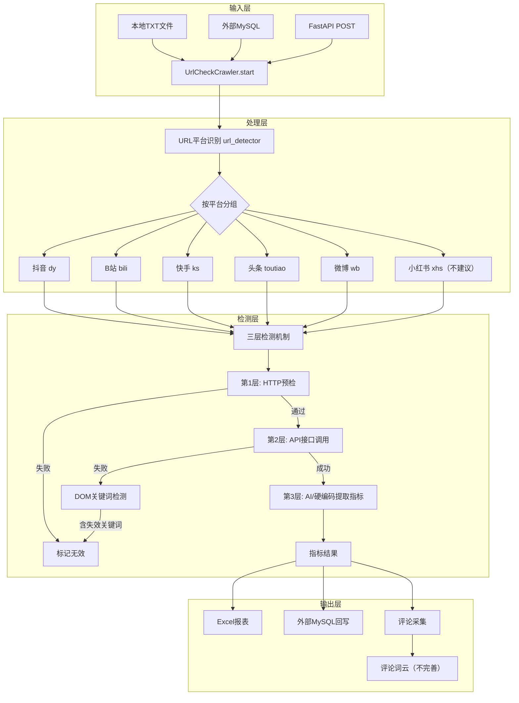
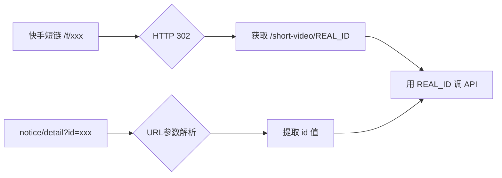
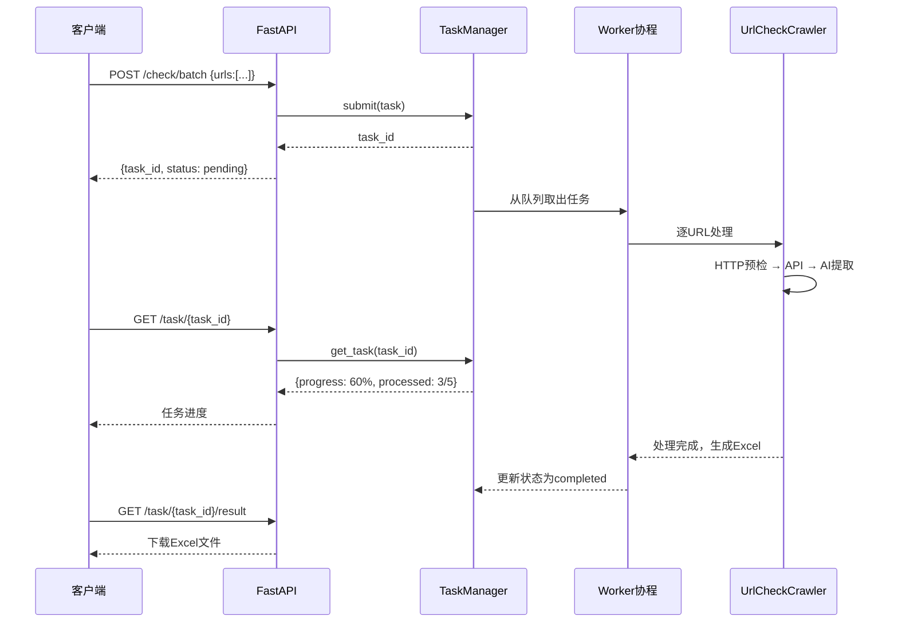

# 功能逻辑指南

## 整体架构



---

## URL 检测三层机制详解

### 第1层：HTTP 预检（无需浏览器）

对每个 URL 发送 HTTP HEAD/GET 请求，快速判断链接状态：

| 检测项 | 判定条件 | 结果 |
|--------|----------|------|
| HTTP 404 | 状态码 = 404 | 链接已删除 |
| HTTP 403 | 状态码 = 403 | 需要登录/无权限 |
| 重定向到首页 | 302 → 平台首页 | 链接失效 |
| 正常响应 | 200 OK | 进入下一层 |

**优势**：不需要启动浏览器，1秒内完成判断，可批量快速过滤。

### 第2层：API 接口调用

通过 Playwright 浏览器维持登录态，调用各平台的接口获取详情 JSON：

| 平台 | 接口方式 | 核心方法 |
|------|----------|----------|
| 抖音 | REST API + Cookie | `DouyinClient.get_video_by_id()` |
| B站 | REST API | `BilibiliClient.get_video_info()` |
| 快手 | GraphQL | `KuaiShouClient.get_video_info()` |
| 头条 | 页面SSR数据提取 | `ToutiaoClient.get_article_info()` |
| 微博 | 页面渲染数据提取 | `WeiboClient.get_note_info_by_id()` |

接口返回后，检查 JSON 中的状态字段判断作品是否有效（如抖音的 `status != 1` 表示已删除）。

### 第3层：AI / 硬编码指标提取

#### AI 模式（默认）

将整个 JSON 发给豆包大模型，提取标准化指标：

```
输入: 平台原始JSON (例如65KB的抖音详情)
↓ 豆包 AI 理解字段语义
输出: {praise_count: 72, reply_count: 22, visit_count: 0, share_count: 1, author: "xxx"}
```

#### 硬编码模式

通过预定义的字段路径直接取值（不消耗 token，速度快）：

```python
# 例如抖音: statistics.digg_count → praise_count
# 例如B站: View.stat.like → praise_count
```

#### 头条 DOM 回退

头条的 SSR 数据经常缺少指标字段，当 AI 提取全为空时，自动启用 DOM 提取：

```
页面DOM → 扫描"点赞"/"评论"/"播放"关键词附近的数字 → 补充指标
```

---

## 各平台适配说明

### 快手短链解析

快手有两种需要特殊处理的 URL 格式：

```
/f/X-5nxgHV3mD0sDA7          → 302重定向 → /short-video/3xj42kcuvnackwi
m.kuaishou.com/notice/detail?id=xxx  → 解析查询参数id
```

处理流程：



### 抖音短链解析

```
iesdouyin.com/share/video/xxx → 302重定向 → douyin.com/video/REAL_ID
```

通过 `_resolve_douyin_share_url` 方法跟随重定向获取真实 aweme_id。

### 头条 DOM 指标提取

头条的网页可能采用客户端渲染，SSR 数据不含完整指标。DOM 提取策略：

1. **CSS 类名匹配**：查找 `[class*="like"]`, `[class*="comment"]` 等元素
2. **文本模式匹配**：扫描页面文本中的"XX评论"、"XX点赞"模式
3. **数字格式化处理**：支持"1.2万"、"3亿"等中文数字格式

---

## FastAPI 任务处理流程



---

## 实例演示：抖音短链完整处理链路

**输入**：`https://www.iesdouyin.com/share/video/7628682927572997561`

### 步骤 1：URL 识别

```
url_detector.detect_platform()
↓
域名: iesdouyin.com → 平台: dy
路径: /share/video/7628682927572997561 → content_id: 7628682927572997561
```

### 步骤 2：HTTP 预检

```
HEAD https://www.iesdouyin.com/share/video/7628682927572997561
↓
302 → https://www.douyin.com/video/7628682927572997561
状态码: 200 → 预检通过
```

### 步骤 3：短链解析

```
_resolve_douyin_share_url()
↓
跟随302重定向 → 提取 /video/7628682927572997561
aweme_id = 7628682927572997561
```

### 步骤 4：API 获取详情

```
DouyinClient.get_video_by_id("7628682927572997561", raw=True)
↓
返回 65KB JSON，包含 aweme_detail
```

### 步骤 5：API 有效性检查

```
check_api_json_validity("dy", raw_json)
↓
检查 status 字段 → status=1（正常） → 有效
```

### 步骤 6：AI 指标提取

```
ai_mapper.extract_metrics("dy", raw_json)
↓
发送给豆包大模型，消耗 37012 tokens
↓
{praise_count: 72, reply_count: 22, visit_count: 0, share_count: 1, author: "淄博、博汇污染犯"}
```

### 步骤 7：评论采集

```
DouyinClient.get_aweme_all_comments(aweme_id="7628682927572997561")
↓
获取 11 条评论 → 写入外部DB + 收集评论文本
```

### 步骤 8：输出

```
Excel 生成:
| 序号 | 内容类型 | 平台名称 | 作者                | 点赞数 | 评论数 | 播放/浏览数 | 分享数 | 链接有效性 | 原始链接 |
| 1    | 视频     | 抖音     | 淄博、博汇污染犯    | 72     | 22     | 0           | 1      | 有效       | https://www.iesdouyin.com/... |

词云生成:
data/url_check/words/url_check_comments_2026-04-27.png
```

---

## 评论抓取支持矩阵

| 平台 | 评论API | 子评论 | 评论入库 | 词云 |
|------|---------|--------|----------|------|
| 抖音 | ✅ | ✅ | ✅ | ✅ |
| B站  | ✅ | ✅ | ✅ | ✅ |
| 快手 | ✅ | ✅ | ✅ | ✅ |
| 头条 | ✅ | ❌ | ✅ | ✅ |
| 微博 | ✅ | ✅ | ✅ | ✅ |
| 小红书 | ❌ | ❌ | ❌ | ❌ |
