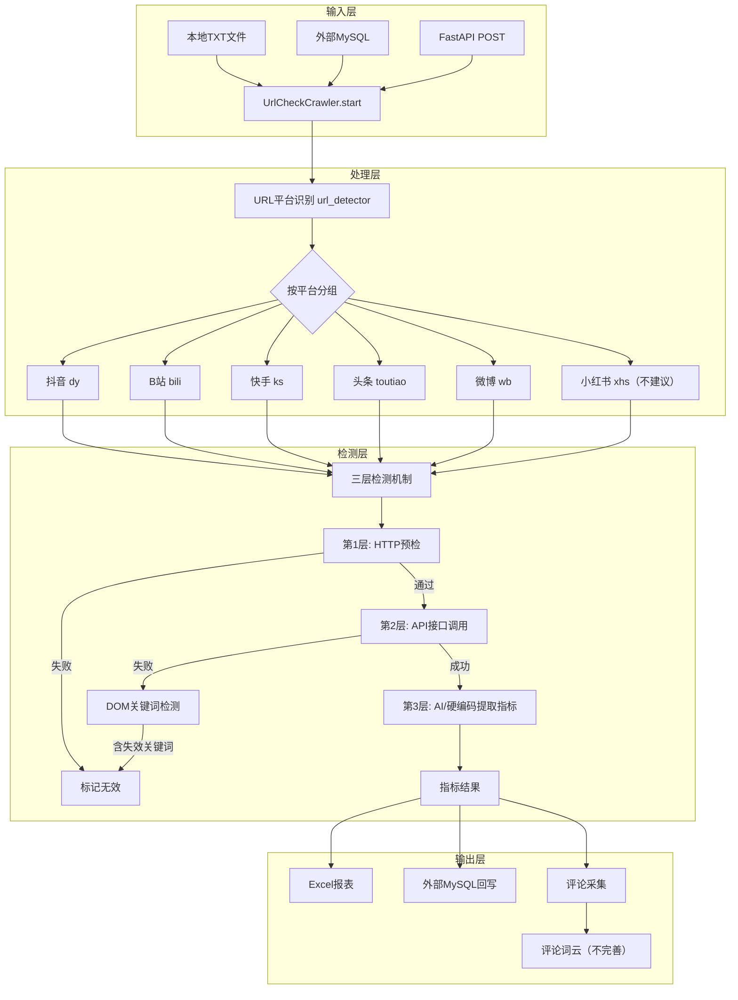

# 多媒体采集项目汇报

## 整体架构

## 预期目标

1. 调整执行逻辑：将 AI 提取接口逻辑后置，在硬文本字段映射失败后触发调用
2. 优化配置方式：通过扫码登录方式批量存储多份 Cookie，替代手动获取 Cookie 的繁琐操作
3. 压测验证：探索单账号、单 IP 环境下，各短视频 / 自媒体平台的爬取风控极限
4. IP代理池/隧道代理

## 完成内容

**1.AI 提取接口逻辑调整**（）

硬文本字段映射优先执行，当点赞数、评论数、播放量均为 0 或 null 时，自动调用 AI 接口提取数据。

**2.扫码登录批量存储 Cookie**（）

计划集成二维码登录功能，实现扫码自动获取、持久化存储多平台 Cookie，支持多账号管理，无需手动复制粘贴 Cookie。

**3.单账号单 IP 风控压测**（）

计划针对抖音、B 站、快手、头条、微博等平台，逐步调整请求频率与并发量，测试并统计各平台风控触发阈值，输出压测分析报告。

**4.IP 代理池 / 隧道代理集成**（）

计划接入动态 IP 代理池 / 隧道代理服务，实现请求自动切换代理 IP，规避平台单 IP 访问频率限制
